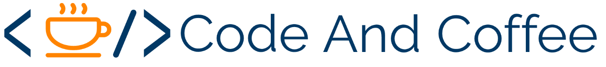

# by Developers at Visma Kosice

Code and Coffee mini sessions are here to boost that enthusiastic programmer inside all of us :)

Welcome to repository containing all Coffee and Code mini sessions source codes and information.
Intention of this content is to open up new areas of programming languages, knowledge, tools, libraries and other interesting and hopefully useful content to Visma Developers at Kosice, Slovakia, but also to anyone else that could find it useful.

## Sessions

| Session | Date | Presenter |
|--------------|----------|--------------|
| [Measure performance of your code with BenchmarkDotNet](https://github.com/DevelopersVismaKosice/CodeAndCoffee/tree/master/sessions/1-Measure%20performance%20of%20your%20code%20with%20BenchmarkDotNet) | 21 Oct 2019 | Michal Lukac |
| [Introduction to Azure Functions](https://github.com/DevelopersVismaKosice/CodeAndCoffee/tree/master/sessions/2-Introduction%20to%20Azure%20Functions) | 4 Dec 2019 | Lukas Vavrek, Matus Mihely |
| [Blazor](https://github.com/DevelopersVismaKosice/CodeAndCoffee/tree/master/sessions/3-Blazor) | 11 Dec 2019 | Stefan Panko | Blazor, WebAssemply, C#, .NET
| Angular Interceptors | 27 Feb 2020 | Erik Hric |
| [visma-slovakia.sk](https://github.com/DevelopersVismaKosice/CodeAndCoffee/blob/master/sessions/5-Visma%20Slovakia/visma-slovakia.pdf) | 3 Dec 2020 | Tomas Blanarik |
| [Kanban](https://github.com/DevelopersVismaKosice/CodeAndCoffee/blob/master/sessions/6-Kanban/Kanban.pdf) | 26 Mar 2020 | Tomas Lojka |
| [Introduction to Docker](https://github.com/DevelopersVismaKosice/CodeAndCoffee/blob/master/sessions/7-Docker%20in%20Practice/Introduction%20to%20Docker.pdf) | 24 Apr 2020 | Michal Lukac |
| [Docker in practice - setup & usage](https://github.com/DevelopersVismaKosice/CodeAndCoffee/blob/master/sessions/Docker%20in%20Practice/README.Session-June-5-2020.md) | 29 May 2020 | Michal Lukac |
| [Docker in practice - docker compose](https://github.com/DevelopersVismaKosice/CodeAndCoffee/blob/master/sessions/Docker%20in%20Practice/README.Session-June-5-2020.md) | 6 Jun 2020 | Michal Lukac |
| [Kubernetes](https://github.com/DevelopersVismaKosice/CodeAndCoffee/blob/master/sessions/8-Kubernetes/README.md) | 8 Oct 2020 | Tomas Blanarik |
| [RabbitMQ vs Azure Queues](https://github.com/DevelopersVismaKosice/CodeAndCoffee/tree/master/sessions/9-RabbitMQ%20vs%20Azure%20Queues) | 19 Oct 2020 | Arpad Restei |

### Enjoy :)

You can also look at out channels at [Facebook](https://www.facebook.com/pg/vismakosice/posts/) and [Twitter](https://twitter.com/VismaDevsSK) to know what we're up to.

Main logo color PANTONE 2955 C - Tardis Blue :)
