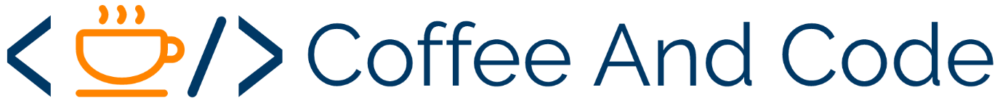

# by Developers at Visma Kosice

Code and Coffee mini sessions are here to boost that enthusiastic programmer inside all of us :)

Welcome to repository containing all Coffee and Code mini sessions source codes and information.
Intention of this content is to open up new areas of programming languages, knowledge, tools, libraries and other interesting and hopefully useful content to Visma Developers at Kosice, Slovakia, but also to anyone else that could find it useful.

## Sessions

| Session | Date | Presenter | for |
|--------------|----------|--------------|--------------|
| Measure performance of your code with BenchmarkDotNet | 21 October 2019 | Michal Lukac | C#, .NET |
| | 28 October 2019 | | |
| Introduction to Azure Functions | 4 December 2019 | Lukas Vavrek, Matus Mihely | C#, .NET |

### Enjoy :)

You can also look at out channels at [Facebook](https://www.facebook.com/pg/vismakosice/posts/) and [Twitter](https://twitter.com/VismaDevsSK) to know what we're up to.

Main logo color PANTONE 2955 C - Tardis Blue :)
