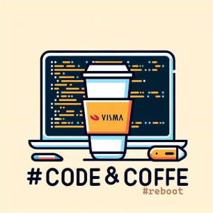

  

# by Developers at Visma Kosice

Code and Coffee mini sessions are here to boost that enthusiastic programmer inside all of us :)

Welcome to repository containing all Coffee and Code mini sessions source codes and information.
Intention of this content is to open up new areas of programming languages, knowledge, tools, libraries and other interesting and hopefully useful content to Visma Developers at Kosice, Slovakia, but also to anyone else that could find it useful.

## Recordings of sessions

All Visma employees are able to also view the recordings [here](https://drive.google.com/drive/u/1/folders/0ByFmB7T5OLmGfnpHcm50WTZYaGRYcGJrZDJMSGdRNmxkUDUwal81VDQxb2xHSzlpLVZzazQ) :).
For relaxed environment for presenters we decided we will not be releasing recordings to general public.

## Sessions

| Session | Date | Presenter |
|--------------|----------|--------------|
| [High Performance C#](https://github.com/DevelopersVismaKosice/CodeAndCoffee/tree/master/sessions/1-High%20Performance%20C%23) | 11 Nov 2024 | Stefan Panko |
|  |  |  |
|  |  |  |

### Enjoy :)

You can also look at out channels at [Facebook](https://www.facebook.com/pg/vismakosice/posts/) and [Twitter](https://twitter.com/VismaDevsSK) to know what we're up to.
