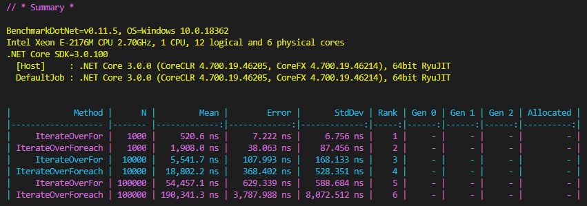

# Measure performance of your code with BenchmarkDotNet
**Code And Coffee, volume 1**
session by Michal Lukac, 21st Oct 2019 11:45

Its always a good reason to consider a performance of your code. So where do you begin ? How do you measure the performance of your code ?
How about measuring how fast does your code execute ? How about knowing how much your code eats into memory and simply see if a small update makes it any better ?

## Meet BenchmarkDotNet
[BenchmarkDotNet](https://github.com/dotnet/BenchmarkDotNet) is awesome .NET library for benchmarking.

## What does it allow you to do


* Easy and quick setup to benchmark smaller code snippets
* Results are returned in a summary object that you could use in any dev or CI/CD pipeline
* Custom input parameters, initial setup and final cleanup
* Supports .NET Framework, .NET Core, CoreRT, and Mono
* Report generation on various formats like json, html, csv, and more

## How do you add it to your project

Install BenchmarkDotNet in .NET Core:

```
dotnet add package BenchmarkDotNet
```

## Our super simple example
Compare For versus Foreach in C# - benchmark it and know for sure the difference ;)

```
using BenchmarkDotNet.Attributes;
using System.Linq;
using System.Collections.Generic;

namespace src
{
    [RPlotExporter, RankColumn]
    public class ForVersusForeach
    {
        [Params(1000, 10000, 100000)]
        public int N;

        public List<int> IterationCollection;

        [GlobalSetup]
        public void Setup()
        {
            IterationCollection = new List<int>(Enumerable.Range(1, N));
        } 

        [Benchmark]
        public void IterateOverFor()
        {
            for(int index = 0; index < N; index++)
            {
                var x = IterationCollection[index] ^ 5;
            }
        }

        [Benchmark]
        public void IterateOverForeach()
        {
            foreach(var item in IterationCollection)
            {
                var x = item ^ 5;
            }
        }
    }
}
```

Results:



## Wide range of possibilities

* Configure set of jobs, columns, exporters, loggers, diagnosers, analysers, validators that help you to build your benchmark
* Different options for customization
* Create custom column and run your custom peace of code
