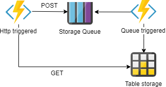

# Introduction to Azure Functions
**Code And Coffee, volume 2**
session by Lukas Vavrek and Matus Mihely, 4th Dec 2019 11:45

Serverless architecture allows you to decompose your solution into very small individual units called functions.
It is highly scalable distributed approach that allows you to focus more on the code and less on the infrastructure.
With combination with public clouds, it is a strong alternative to monoliths and microservices.

In this talk, you'll learn how to build a simple function based solution build on top of the Azure Functions.

