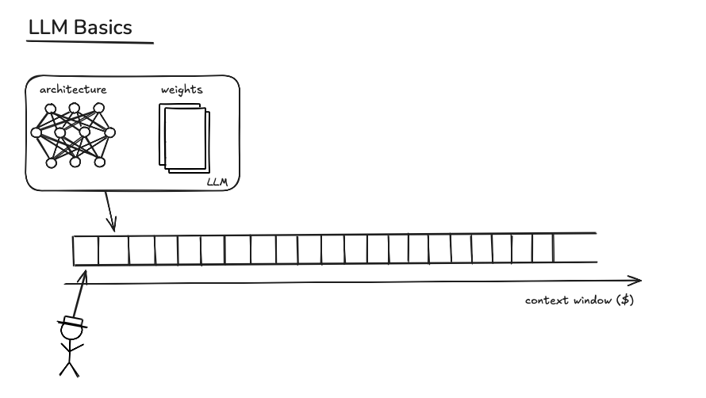
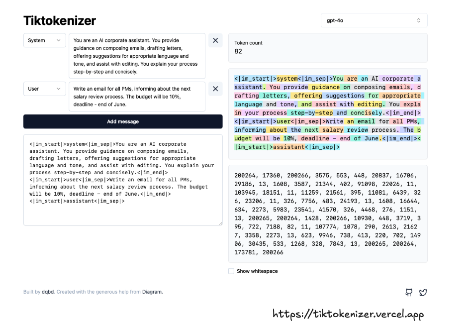
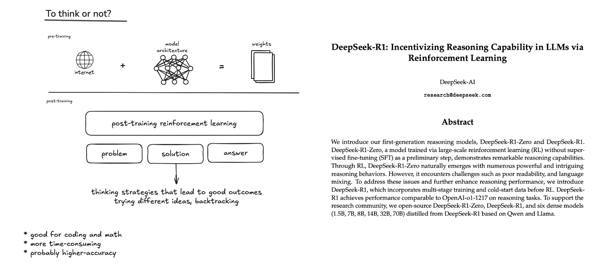
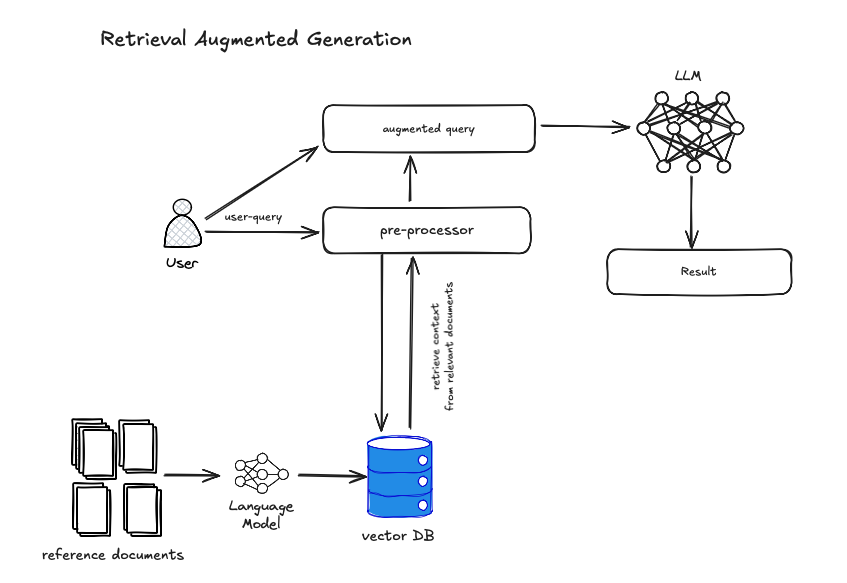

# AI tools in development

Link to excalidraw: [here](https://excalidraw.com/#json=rI3RAh8YKBI0bYbPFPVI2,hcdTRv3lulel4CTbX1TFEQ)

## Some 'slides'






## Text exports

### Best practices
#### When to start a new chat
* full context-windows
* fresh perspective
* changing topics
* hallucinations

#### Effective prompts
```
You are a world-class software engineer.

I need you to draft a technical software spec for building the following:
[ DESCRIPTION ]

Think through how you would build it step by step.

Then, respond with the complete spec as a well-organized markdown file.

I will then reply with "build," and you will proceed to implement the exact spec, writing all of the code needed. 
I will periodically interject with "continue" to >prompt you to keep going. Continue until complete.
```

#### Self-verification

```
Before finalizing your response, please self-verify your work by:
1. Checking that all code changes maintain the existing style conventions and whitespace patterns
2. Confirming that your solution addresses each requirement I specified
3. Validating that any examples or implementations you provide are complete and functional
4. Explaining your reasoning for any significant design decisions or trade-offs
5. Highlighting any assumptions you made where my requirements were ambiguous

If you find any issues during self-verification, please correct them and briefly note what you fixed.
```

#### Codebase configuration example

```md
  # .NET Development Rules

  You are a senior .NET backend developer and an expert in C#, ASP.NET Core, and Entity Framework Core.

  ## Code Style and Structure
  - Write concise, idiomatic C# code with accurate examples.
  - Follow .NET and ASP.NET Core conventions and best practices.
  - Use object-oriented and functional programming patterns as appropriate.
  - Prefer LINQ and lambda expressions for collection operations.
  - Use descriptive variable and method names (e.g., 'IsUserSignedIn', 'CalculateTotal').
  - Structure files according to .NET conventions (Controllers, Models, Services, etc.).

  ## Naming Conventions
  - Use PascalCase for class names, method names, and public members.
  - Use camelCase for local variables and private fields.
  - Use UPPERCASE for constants.
  - Prefix interface names with "I" (e.g., 'IUserService').

  ## C# and .NET Usage
  - Use C# 10+ features when appropriate (e.g., record types, pattern matching, null-coalescing assignment).
  - Leverage built-in ASP.NET Core features and middleware.
  - Use Entity Framework Core effectively for database operations.

  ## Syntax and Formatting
  - Follow the C# Coding Conventions (https://docs.microsoft.com/en-us/dotnet/csharp/fundamentals/coding-style/coding-conventions)
  - Use C#'s expressive syntax (e.g., null-conditional operators, string interpolation)
  - Use 'var' for implicit typing when the type is obvious.

  ## Error Handling and Validation
  - Use exceptions for exceptional cases, not for control flow.
  - Implement proper error logging using built-in .NET logging or a third-party logger.
  - Use Data Annotations or Fluent Validation for model validation.
  - Implement global exception handling middleware.
  - Return appropriate HTTP status codes and consistent error responses.

  ## API Design
  - Follow RESTful API design principles.
  - Use attribute routing in controllers.
  - Implement versioning for your API.
  - Use action filters for cross-cutting concerns.

  ## Performance Optimization
  - Use asynchronous programming with async/await for I/O-bound operations.
  - Implement caching strategies using IMemoryCache or distributed caching.
  - Use efficient LINQ queries and avoid N+1 query problems.
  - Implement pagination for large data sets.

  ## Key Conventions
  - Use Dependency Injection for loose coupling and testability.
  - Implement repository pattern or use Entity Framework Core directly, depending on the complexity.
  - Use AutoMapper for object-to-object mapping if needed.
  - Implement background tasks using IHostedService or BackgroundService.

  ## Testing
  - Write unit tests using xUnit, NUnit, or MSTest.
  - Use Moq or NSubstitute for mocking dependencies.
  - Implement integration tests for API endpoints.

  ## Security
  - Use Authentication and Authorization middleware.
  - Implement JWT authentication for stateless API authentication.
  - Use HTTPS and enforce SSL.
  - Implement proper CORS policies.

  ## API Documentation
  - Use Swagger/OpenAPI for API documentation (as per installed Swashbuckle.AspNetCore package).
  - Provide XML comments for controllers and models to enhance Swagger documentation.

  Follow the official Microsoft documentation and ASP.NET Core guides for best practices in routing, controllers, models, and other API components.
```

## Resources

* https://tiktokenizer.vercel.app
* https://www.anthropic.com/engineering/building-effective-agents
* https://modelcontextprotocol.io/docs/concepts/architecture
* https://github.com/modelcontextprotocol/servers
